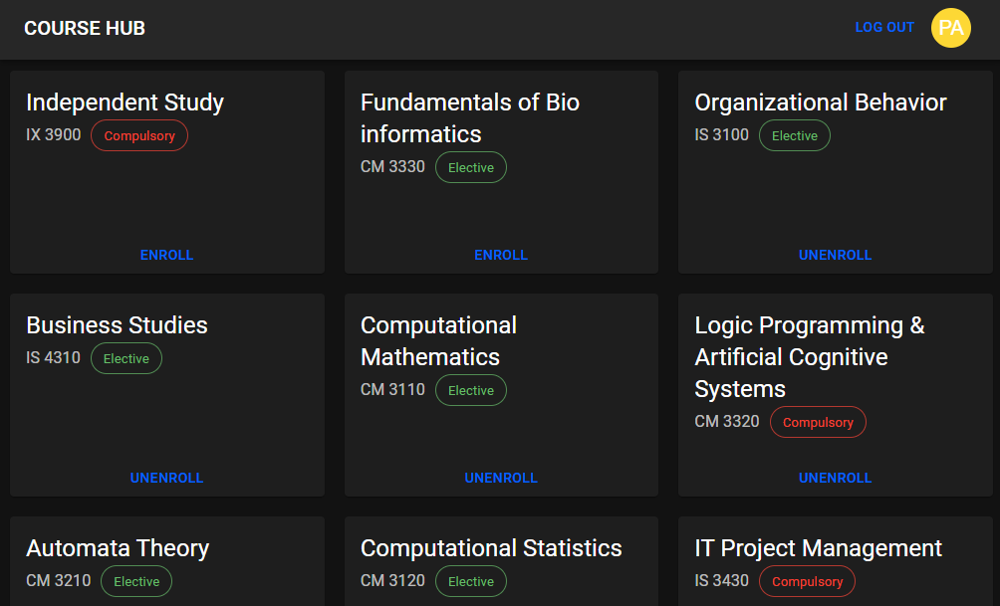
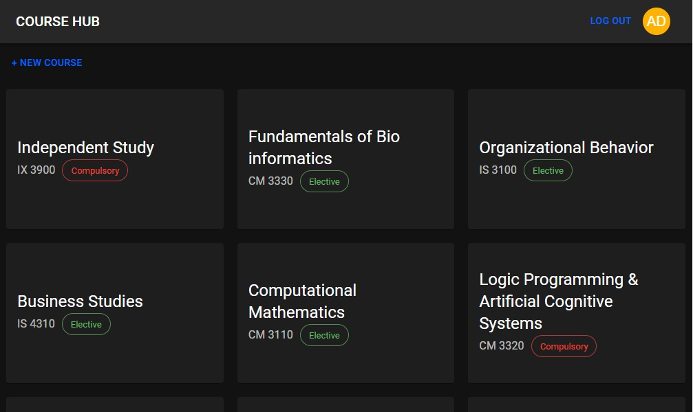
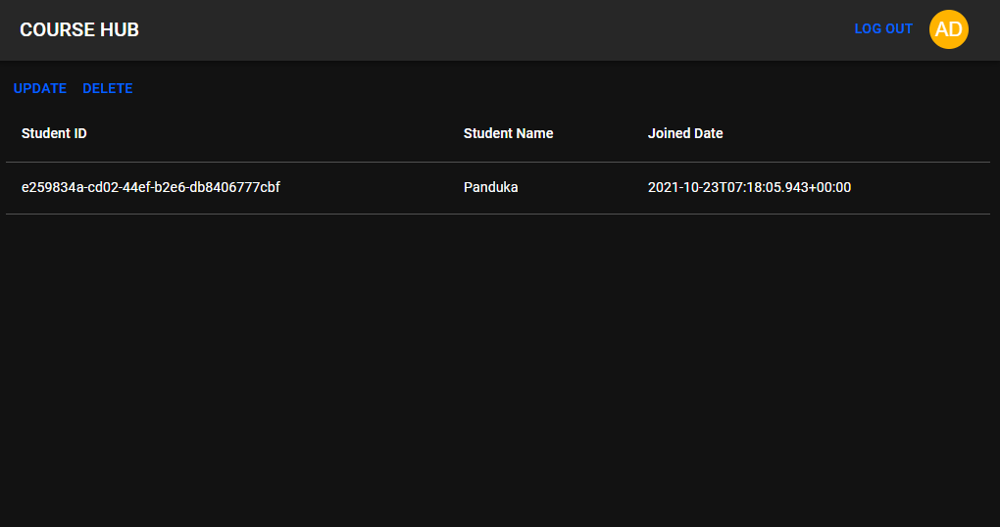

# ༒☬༒ ꜱᴘʀɪɴɢ ʙᴏᴏᴛ + ᴋᴏᴛʟɪɴ  ༒☬༒
This project is simple course enrolment site built with React with Typescript and Spring boot with Kotlin. 

## Frontend - Overview 🌐
The idea of the project is inspired from our course enrolment site [https://lms.uom.lk/](https://lms.uom.lk/) 
where student can see the available courses and select the courses that they want to enrol. After that admin can
see the enrolled student and take necessary actions. Firstly the student can all available courses as Follows.



If they click on enrol button they will be redirected to the login page. Otherwise, they have to sign up. After
successfully sign up or log in, they can click the enrol button. There is a type of role called Admin.
The admin is created when the database data is propagated. Admin can use the same log-in button as student.
The admin cannot enrol to the system instead they can view the students who enrolled to the course.




An admin can change the course details as well as he can delete the course.

### Frontend - Technologies 🛠
I used React as the frontend development  technology as React with Typescript. This way I was able to get the
help from VSCode intellisense to maximize my coding productivity.

## Backend - Overview 🔙
The backend is implemented using Spring Boot. Since there are authentication is required I used Spring security.
Some endpoints are secured but others are not. There are two type of roles named `ADMIN` and `STUDENT`. 
There are some endpoints which is only accessible for `ADMIN`. I implemented an annotation called `AdminPermission`.

```kotlin
@Inherited
@PreAuthorize("hasAuthority(T(lk.uom.itfac.panduka18.coursehub.constant.Role).ADMIN)")
annotation class AdminPermission
```
If we apply this into a controller method as follows we can filter only admin requests. 

```kotlin
@DeleteMapping("/{courseId}")
@AdminPermission
fun deleteCourse(@PathVariable courseId: UUID, @CurrentUser userPrincipal: UserPrincipal?) {
    courseService.delete(courseId)
}
```

### Backend - Technologies ⚙
Since I already have a very good experience in Spring Boot as I created microservice based Spring Boot server 
in Second year project, this time I wanted to make this server different. I used **Kotlin** as 
programming language for the Spring boot server. Kotlin is designed to interoperate fully with Java and JVM. 
Therefore, anything we write using Java can convert to Kotlin and vise versa. The advantage is that I was able 
to decrease huge boilerplate codes such as getters and setters by using Kotlin. 

## Deployment 🐳
Since the frontend is built with React and the backend is built with Spring Boot the frontend and 
the backend have to be bunndled together for that I used `frontend-maven-plugin` and `maven-resources-plugin` to put 
react build file into Spring boot JAR file.

### Credentials
Username and password for admin is as follows.
- username: admin
- password: admin


